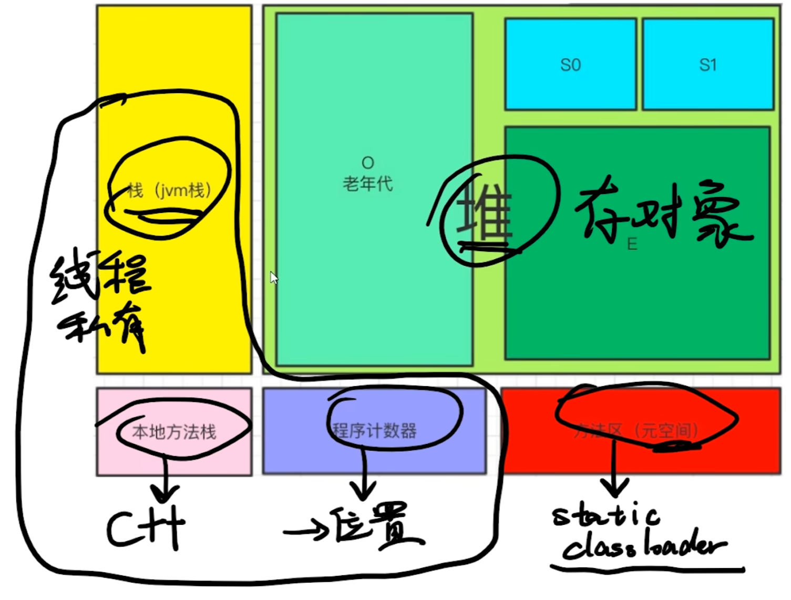

# Java


## 基础介绍


### jconsole

java进程调试工具

```yaml
jsonsole:

```

### jmap

查看java运行堆信息

```yaml
jamp:

```


### jps

查看java运行进程信息

```yaml
jps:

```

### jstack

查看java运行栈信息

```yaml
jstack:

```


### jstat

查看java运行进程内存信息

```yaml
jstat:

```


## 核心内容
```
java:

```


### JVM




### ClassFile
```
ClassFile { 类文件组成
   u4 magic;
   u2 minor_version;
   u2 major_version;
   u2 constant_pool_count;
   cp_info constant_pool[constant_pool_count-1];
   u2 access_flags;
   u2 this_class;                    本类索引（常量池）
   u2 super_class;                   父类索引（常量池）
   u2 interfaces_count;
   u2 interfaces[interfaces_count];
   u2 fields_count;
   field_info fields[fields_count];
   u2 methods_count;
   method_info methods[methods_count];
   u2 attributes_count;
   attribute_info attributes[attributes_count]; 类属性
}

cp_info { 常量池字段
    ul tag;
    ul info[];
}

field_info { 字段
    u2 access_flags;
    u2 name_index;
    u2 descriptor_index;
    u2 attributes_count;
    attribute_info attributes[attributes_count]; 字段属性
}

method_info { 方法
    u2 access_flags;
    u2 name_index;
    u2 descriptor_index;
    u2 attributes_count;
    attribute_info attributes[attributes_count]; 方法属性
}
```


#### Attribute属性
- Code: 函数代码
- ConstantValue：常量值
- Exception: 函数抛出异常
- LineNumberTable: 行号
- LocalVariableTable: 局部变量表


#### 方法指令

值的操作都是在栈上进行的

```yaml
:
    aload_{n}: 按照对象类型加载第n个变量到栈顶
    bipush:
    dup:
    dup2: 栈上复制操作数
    goto: 直接跳转
    iadd:
    iconst_{n}: load优化
    if_{t}cmp{cond}: 比较跳转
    if{cond}: 条件跳转
    iinc: ++操作符
    iload_{n}:
    invokedynamic:
    invokeinterface:
    invokespecial: 特殊方法调用
    invokestatic:
    invokevirtual:
    ireturn: 函数返回
    istore: 存储值到变量中
    ldc: 加载常量到栈中
    new: 创建对象（堆上）
    pop:
    pop2: 栈上弹出操作数
    putfield: 放入字段中
    {t}add:
    {t}and:
    {T}div:
    {t}mul:
    {t}sub:
```

return之后需要保证栈是空的

