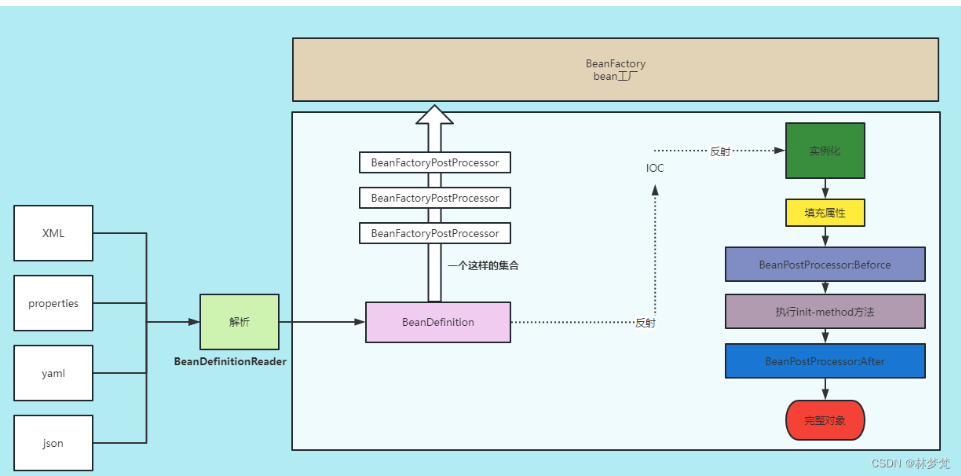

# Spring

## 基础介绍





## 核心内容
```yaml
org.springframework:
    aop:
    beans:
        factory:
            Aware:
    context:
```

### Aware

依赖注入的实现原理

常用的Aware:
- ApplicationContextAware
- BeanNameAware
- BeanClassLoaderAware
- BeanFactoryAware
- EnviromentAware
- EnvironmentValueResolverAware
- ResourceLoaderAware
- ApplicationEventPublisherAware
- MessageSourceAware	