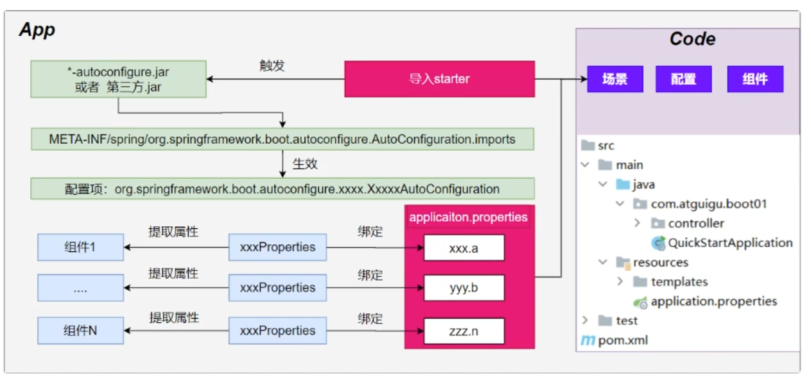

# SpringBoot

>
>`# TODO 尚硅谷SpringBoot零基础教程，面试&加薪必会springboot3 P11`
>

## 基础介绍

### applicationi.yaml
```yaml

```


## 核心内容
```yaml
org.springframework:
    ui:
        Model:
    web:
        bind:
            annotation:
                GetMapping:
```


### 自动装配

- 条件注解
- 包扫描
- 配置Properties
- spring.factories


`spring-boot-autoconfigure`、`AutoConfiguration`类、`spring.factories`




### 日志


### Thymeleaf


内置属性`th`:
```yaml
th:
    case: switch匹配
    classappend: css类属性添加
    content:
    each: 循环渲染
    fragment: 片段定义（可被引用）,可传参，可插槽
    href: static资源引用
    if: 条件渲染
    inline:
    insert: 插入fragment
    replace: 替换fragment
    switch:
    text:
    object: with 
```


内置变量：
```yaml
dates:
    format:
session:

```


