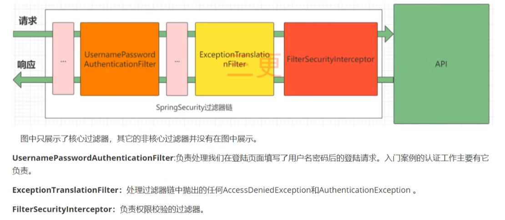
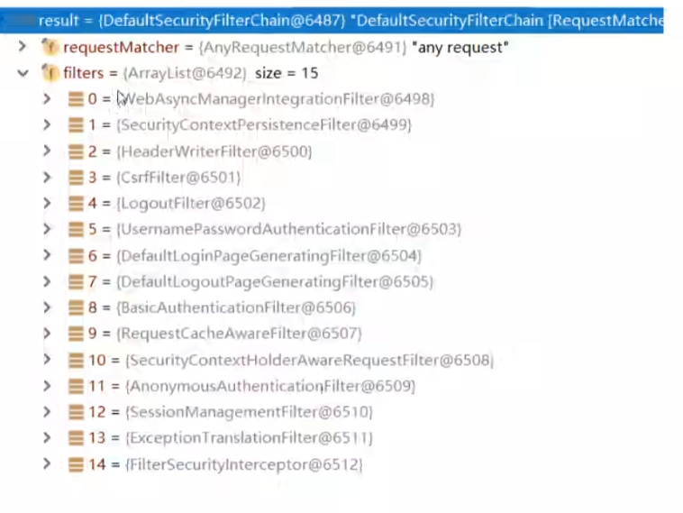
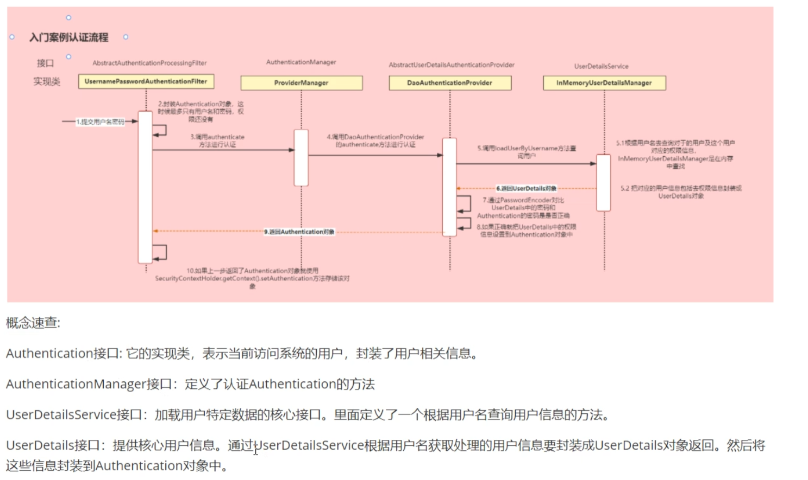
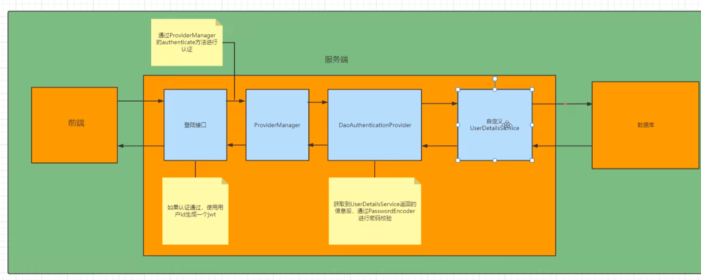
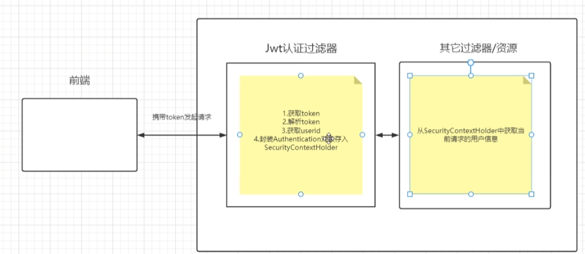

# SpringSecurity

>
>`# TODO SpringSecurity框架教程-Spring Security+JWT实现项目级前端分离认证授权-挑战黑马&尚硅谷 P34`
>


## 基础介绍


## 核心内容
```yaml
org.springframework.security:
    core:
        userdetails:
            UserDetails:
            UserDetailsService:
            UsernameNotFoundException:
        GrantedAuthority:
    web:
        DefaultSecurityFilterChain:
            filters:
            requestMatcher:
```


### 认证、授权





#### filters



SpringSecurity默认有14个过滤器


#### Authentication


认证：登录、校验










查询不到用户，应该抛出异常

认证失败也应该抛出异常

#### Authorization

授权

RBAC


#### Handler处理


- 认证成功
- 认证失败
- 授权失败
- 登出成功

