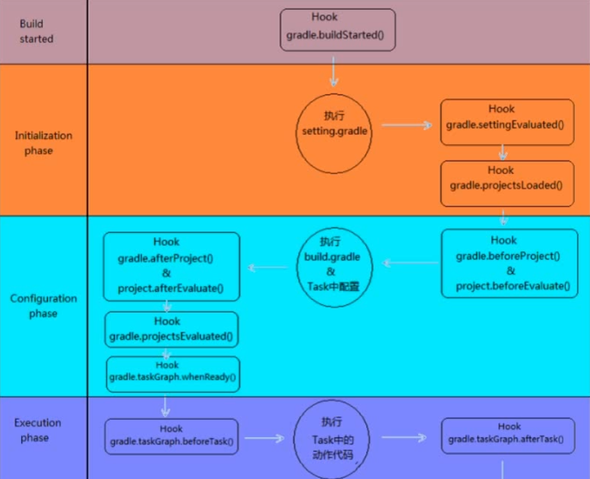

# Gradle


## 基础介绍


### gradle
gradle
```
```

### 项目配置
#### build.gradle

项目的核心配置文件

<br>


```gradle
plugins:
    id

group:
version:
sourceCompatibility:

// 仓库
repositories {
    mavenCentral()
}

// 依赖
dependencies {
    testCompile
}
```
#### settings.gradle

多项目配置文件

```gradle
rootProject:
    name
```

<br>

## 核心内容


### Project

project中的常用配置
- repositories
- dependencies
- plugins
- task
- ext


<br>

### Task

task常用配置
- description
- group: task分组（默认other）
- denpendsOn:
- type: 类型分类（Copy | JavaExec | ）
- doFirst | doLast
- ext: 给任务添加自定义属性


#### 依赖顺序


#### 生命周期


初始化阶段 -> 配置阶段 -> 执行阶段

#### 版本冲突
Maven 按最短路径原则和优先声明原则来处理

Gradle 按版本最高的来处理

